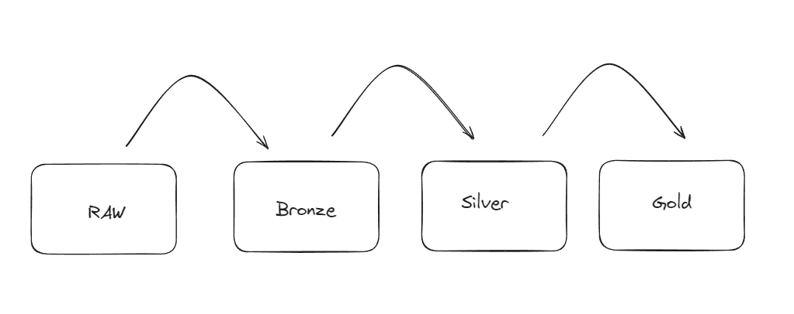
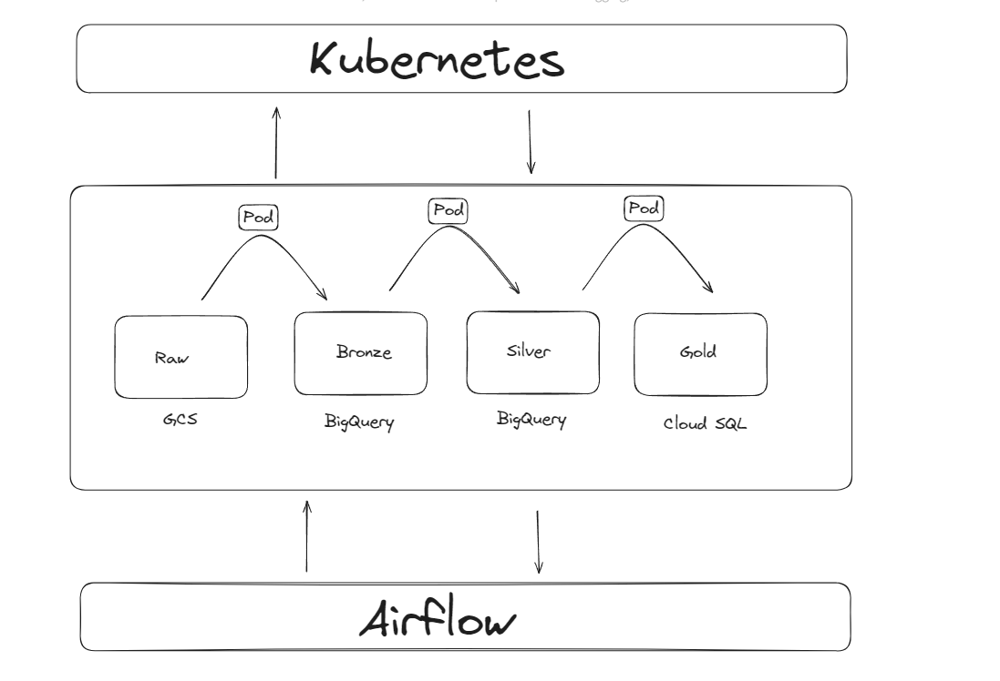

# bayer-challenge

## Proposed Architecture



This architecture is based on the medallion architecture of data lakehouses. Each component is described below:

### Raw
This layer receives data from the original sources. In this case, the data did not require any extraction process as they were already in the designated folder.

### Bronze
This layer receives data after initial processing, which includes casting, renaming columns, and standardizing strings. No business rules are applied at this stage.

Tasks performed in this case:

- Processing null values
- Standardizing column names
- Transforming column data types
- Standardizing strings in columns
- Removing accents and punctuation

### Silver
This layer contains data that has been processed with some business rules applied.

Tasks performed in this case:

- Creating columns
- Selecting columns
- Aggregating data

### Gold
The final layer, where data is prepared for use by BI users or data scientists.

Tasks performed in this case:

- Table binding
- Table joins

## Code Architecture

Within the **src** folder, you will find the core of the application. Here is a brief explanation of each module:

- extractors: Classes responsible for extracting data according to the source
- loaders: Classes that load data into a predefined destination
- factory: A factory that creates transformation classes for each ETL process
- pandas_processor: Classes that handle data processing
- logger: A class that assists with application logging
- etl_layers.py: Contains classes that perform ETL processes between layers

The **data** folder at the root directory contains the data used throughout the project. The folder structure represents the layers mentioned above.

The **main.py** file is the project's entry point.

# Running the Project

**Install Virtualenv**: If you don't have it already, install the virtualenv package using pip:

```sh
pip install virtualenv
```

**Create a Virtual Environment**: Create a virtual environment named `bayer` using the following command:

```sh
virtualenv bayer
```

**Activate the Virtual Environment**: Activate the virtual environment to start using it:

### Mac/Linux

```sh
source bayer/bin/activate
```

### Windows

```sh
bayer\Scripts\activate
```

**Install Dependencies**: Install the required packages listed in `requirements.txt` using pip:

```sh
pip install -r requirements.txt
```

**Execute Main Script**: Run the main script `main.py` to initiate data preprocessing:

```sh
python main.py
```

Esse codigo ira produzir o resultado dentro da pasta ``` data/gold/datamart.sql ```


# Automating for Production



Here is a proposal to deploy a project like this to production, scalable when needed:

**Airflow**: Orchestrates the ETLs in a DAG, allowing us to define update frequency and monitor pipelines.

**Kubernetes**: Processes the DAGs, ensuring smooth scaling when necessary.

**Google Cloud Storage**: Serves as our RAW layer, receiving data in its original format. It is low-cost and scalable.

**BigQuery**: Acts as our Bronze and Silver layers due to its processing power and usage-based pricing. This is where Airflow-scheduled processes will reside.

**Google Cloud Storage**: Also serves as our Gold layer, or data warehouse. Since this is the final layer with many non-systematic requests from BI users, it is cost-efficient as it is priced according to instance size.

# Data Quality and Integrity

## Between the Raw and Bronze Layers

To ensure data quality, we can implement a process before data reaches the raw layer to ensure the data contract is respected. We can check for example:

- Table/Entity Structure: Verify that all required tables or entities are present.
- Data Types: Confirm that the data types of each field match the specifications.
- Field Length: Ensure the field lengths (e.g., maximum string lengths) are correct.
- Load and Stress Testing: Evaluate how the data contract behaves under heavy loads.
- Response Time: Measure response times for common operations to ensure they are within acceptable limits.

## Between the Bronze and Silver Layers

To ensure data integrity, we can implement processes to check between the bronze and silver layers. For example:

- Primary Keys: Verify that all primary keys are present and unique.
- Foreign Keys: Confirm that all foreign keys reference valid records in other tables.
- Uniqueness Constraints: Ensure that fields that must be unique do not have duplicate values.
- Cross-Field Consistency: Check that values in different fields are consistent.
- Cross-References: Confirm that referenced data in different parts of the contract are consistent with each other.
- Domain-Specific Rules: Validate any specific business rules.
- Conditions and Constraints: Check that specific conditions and constraints are respected.
